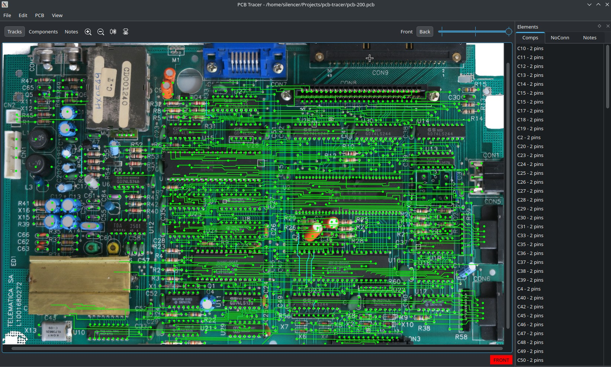
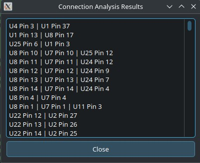

# PCB Tracer

PCB Tracer is an application for analyzing and documenting PCB layouts. It allows users to trace circuit paths, identify components, and generate comprehensive connection lists. This tool is designed to aid in reverse engineering, repair, and documentation of printed circuit boards.

<figure>
  
</figure>
<figure>
  
</figure>  
<figure>
  
</figure>


## Features

- Load and display PCB images (front and back sides)
- Trace circuit paths with adjustable track width
- Add and manage component annotations
- Generate connection lists
- Configurable color schemes

## Installing

### On Arch Linux:

Use the `pcb-tracer-git` package from the AUR.

## Compilation Instructions

### On Arch Linux:

1. Install the required dependencies:
   ```
   sudo pacman -S cmake qt6-base
   ```
2. Clone the repository:
   ```
   git clone https://github.com/rpelorosso/pcb-tracer.git
   cd pcb-tracer
    ```
4. Create a build directory and navigate to it:
   ```
   mkdir build
   cd build
   ```
5. Run CMake and compile:
   ```
   cmake ..
   make -j$(nproc)
   ```
7. Run the application:
   ```
   ./pcb-tracer
   ```

## Usage

1. Launch PCB Tracer
2. Load PCB images using File -> Set front side image and File -> Set back side image
3. Use the toolbar to switch between track, component, and note modes
4. Trace circuits, add components, and annotate as needed
5. Generate connection lists using PCB -> View Connections
6. Save your work using File -> Save or File -> Save As


## Keyboard Shortcuts

- Ctrl+C: Enter Component mode
- Ctrl+T: Enter Track mode
- Ctrl+N: Enter Notes mode
- Ctrl+E: View Connections
- Ctrl+Z: Undo
- Ctrl+Y: Redo

## Contributing

Contributions are welcome! Please feel free to submit a Pull Request.

## License

This project is licensed under the GNU License.

## Support

For bug reports and feature requests, please use the GitHub Issues tracker.

## Roadmap

- When two links cross in the same side, ask the user if they should effectively be joined.
- Configuration changes should trigger a new action so it appears in the undo stack.
- Automate creation of meshes and schematics in KiCad.

